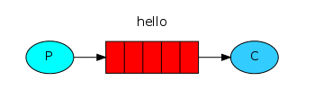

Pika是RabbitMQ推荐的python库


# MQ简介

MQ（Message Queue，消息队列），是一个在消息传输过程中保存消息的容器，多用在分布式系统之间进行通信。

**MQ优势**

- 应用解耦：提高系统容错性和可维护性。
- 异步提速：提升用户体验和系统吞吐量，MQ可短时间接收和保存大量消息（请求），其他服务可以异步地进行消息的消费。
- 削峰填谷：提高系统稳定性，当MQ中保存了大量消息（请求）后，其他服务就可以按照自身的需要从容地对MQ中的消息进行消费，而不必直接去处理大量请求

**MQ劣势**

- MQ属于系统引入的外部依赖，一旦MQ宕机，就会对业务造成影响。

# RabbitMQ简介

AMQP（Advanced Message Queuing Protocol，高级消息队列协议），是一个网络协议，同时也是一个应用协议的开放标准，专为面向消息的中间件而设计。

RabbitMQ是基于AMQP并使用Erlang语言开发的消息中间件

## 相关概念

- Broker：接收和分发消息的应用，RabbitMQ Server就是Message Broker。
- Virtual host：出于多租户和安全因素的设计，把AMQP的基本组件划分到一个虚拟的分组中，类似于网络中的namespace概念，**当多个不同的用户使用同一个RabbitMQ Server提供的服务时，可以划分出多个vhost，每个用户在自己的vhost创建exchange/queue等**。
- Connection：publisher/consumer和broker之间的TCP连接。
- Channel：如果每一次访问RabbitMQ都建立一个Connection，在消息量大的时候建立TCP Connection的开销都将是巨大的，效率也是非常低的。Channel是在Connection内部建立的逻辑连接，如果应用程序支持多线程，通常每个thread会创建单独的Channel进行通信，AMQP的method包含了channel id帮助客户端和message broker识别channel，所以**channel之间是完全隔离的。Channel作为轻量级的Connection，极大减少了操作系统建立TCP连接的开销。**

## 相关术语

- producer：生产者，向队列中发送消息的程序。（在图表中通常使用P表示）
- queue：队列，用于存储消息，定义在RabbitMQ内部，queue本质上是一个消息缓存buffer，生产者可以往里发送消息，消费者也可以从里面获取消息。（在图表中通常使用Q表示）
- consumer：消费者，等待并从消息队列中获取消息的程序。（在图表中通常使用C表示）
- exchange：交换机，用于将producer发送来的消息发送到queue，事实上，producer是不能直接将message发送到queue，必须先发送到exchange，再由exchange发送到queue。（在图表中通常使用X表示）
- 注：生产者和消费者可能在不同的程序或主机中，当然也有可能一个程序有可能既是生产者，也是消费者。

# RabbitMQ六种模式

运行本文中的示例代码时，请务必先安装好RabbitMQ服务和Pika插件。

六种模式分别为Hello world、Work queues（工作队列）、Publish/Subscribe（发布订阅）、Routing（路由）、Topics（主题）、RPC（远程调用）

处了RPC模式外，基本的代码框架都是差不多的，只是在不同的模式下达到的效果不同，它们各有各的特点，在实际使用中应该根据需求来选择具体的模式

## hello world模式



Hello world模式是最简单的一种模式，一个producer发送message，另一个consumer接收message。

producer示例 `send.py` ：producer端发送message会涉及最简单的5个步骤，具体见代码注释。

```python
import pika

# 1. 创建一个到RabbitMQ server的连接，如果连接的不是本机，
# 则在pika.ConnectionParameters中传入具体的ip和port即可
connection = pika.BlockingConnection(
    pika.ConnectionParameters('localhost'))
# 2. 创建一个channel
channel = connection.channel()
# 3. 创建队列，queue_declare可以使用任意次数，
# 如果指定的queue不存在，则会创建一个queue，如果已经存在，
# 则不会做其他动作，官方推荐，每次使用时都可以加上这句
channel.queue_declare(queue='hello')
# 4. 发布消息
channel.basic_publish(
    exchange='',  # RabbitMQ中所有的消息都要先通过交换机，空字符串表示使用默认的交换机
    routing_key='hello',  # 指定消息要发送到哪个queue
    body='Hello world!')  # 消息的内容
# 5. 关闭连接
connection.close()
```

consumer示例 `receive.py` ：consumer端接收message会涉及最简单的6个步骤，具体见代码注释。

```python
import pika


def main():
    # 1. 创建一个到RabbitMQ server的连接，如果连接的不是本机，
    # 则在pika.ConnectionParameters中传入具体的ip和port即可
    connection = pika.BlockingConnection(
        pika.ConnectionParameters('localhost'))
    # 2. 创建一个channel
    channel = connection.channel()
    # 3. 创建队列，queue_declare可以使用任意次数，
    # 如果指定的queue不存在，则会创建一个queue，如果已经存在，
    # 则不会做其他动作，官方推荐，每次使用时都可以加上这句
    channel.queue_declare(queue='hello')

    # 4. 定义消息处理程序
    def callback(ch, method, properties, body):
        print('[x] Received %r' % body)

    # 5. 接收来自指定queue的消息
    channel.basic_consume(
        queue='hello',  # 接收指定queue的消息
        on_message_callback=callback,  # 接收到消息后的处理程序
        auto_ack=True)  # 指定为True，表示消息接收到后自动给消息发送方回复确认，已收到消息
    print('[*] Waiting for message.')
    # 6. 开始循环等待，一直处于等待接收消息的状态
    channel.start_consuming()


if __name__ == '__main__':
    main()

```

注：示例代码来自 https://www.rabbitmq.com/tutorials/tutorial-one-python.html

## Work queues模式


Work queues模式即工作队列模式，也称为Task queues模式（任务队列模式），

这个模式的特点在于，同一个queue可以允许多个consumer从中获取massage，

RabbitMQ默认会从queue中依次循环的给不同的consumer发送message。

与Hello world模式相比，工作队列模式在示例代码中有以下不同：

- hello world模式中指定了 `auto_ack=True` ，表示consumer接收到message之后自动发送确认标识，告诉RabbitMQ可以从队列中移除该条message了。工作队列模式下，使用了默认值，即需要手动确认 `ch.basic_ack(delivery_tag=method.delivery_tag)` 。
- hello world模式中只有一个consumer去处理queue中的message，工作队列模式中可以有多个consumer去处理queue中的message。
- 工作队列模式中可以使message持久化，保证RabbitMQ服务挂掉之后message依然不被丢失。
- 工作队列模式中可以手动标记message已接收并处理完成（这一步在编程时千万别忘了，否则RabbitMQ会认为该条message没有被处理，会一直保留在队列中，并适时发送到别的consumer中）。

producer示例 `new_task.py` ：注意如果声明queue时参数不一样，则建议换一个名称，因为RabbitMQ中不允许同名但实际上是不同的两个queue存在，比如指定了 `durable=True` 参数。

```python
import pika

connection = pika.BlockingConnection(
    pika.ConnectionParameters(host='localhost'))
channel = connection.channel()

# 声明durable=True可以保证RabbitMQ服务挂掉之后队列中的消息也不丢失，原理是因为
# RabbitMQ会将queue中的消息保存到磁盘中
channel.queue_declare(queue='task_queue')

message = 'Hello World! 555'
channel.basic_publish(
    exchange='',
    routing_key='task_queue',
    body=message,
    # delivery_mode=2可以指定此条消息持久化，防止RabbitMQ服务挂掉之后消息丢失
    # 但是此属性设置并不能百分百保证消息真的被持久化，因为RabbitMQ挂掉的时候
    # 它可能还保存在缓存中，没来得及同步到磁盘中
    # properties=pika.BasicProperties(delivery_mode=2)
)
print(" [x] Sent %r" % message)
connection.close()
```

consumer示例 `worker.py` ：RabbitMQ会将queue中的消息依次发送给不同的consumer，所以这里的示例可以用同样的代码多开几个客户端进行测试。

```python
import pika
import time

connection = pika.BlockingConnection(
    pika.ConnectionParameters(host='localhost'))
channel = connection.channel()

# 声明durable=True可以保证RabbitMQ服务挂掉之后队列中的消息也不丢失，原理是因为
# RabbitMQ会将queue中的消息保存到磁盘中
channel.queue_declare(queue='task_queue')
print(' [*] Waiting for messages.')


def callback(ch, method, properties, body):
    print(" [x] Received %r" % body.decode())
    # 此处以消息中的“.”的数量作为sleep的值，是为了模拟不同消息处理的耗时
    time.sleep(body.count(b'.'))
    print(" [x] Done")
    # 手动标记消息已接收并处理完毕，RabbitMQ可以从queue中移除该条消息
    ch.basic_ack(delivery_tag=method.delivery_tag)


# prefetch_count表示接收的消息数量，当我接收的消息没有处理完（用basic_ack
# 标记消息已处理完毕）之前不会再接收新的消息了
channel.basic_qos(prefetch_count=1)
channel.basic_consume(queue='task_queue', on_message_callback=callback)

channel.start_consuming()

```

我运行了两个 `worker.py` ，并执行了5次 `new_task.py` ，分别发送了5条message：“Hello World! 111”、“Hello World! 222”、“Hello World! 333”、“Hello World! 444”和“Hello World! 555”，两个worker的打印输出如下：可以看出两个worker是轮流获取到消息的，并且同一条消息也不会发送给两个worker，这也是RabbitMQ默认的消息发送机制。

注：示例代码来自 https://www.rabbitmq.com/tutorials/tutorial-two-python.html


## Publish/Subscribe模式


相对于工作/任务模式中的一个message只能发送给一个consumer使用，发布订阅模式会将一个message同时发送给多个consumer使用，其实就是producer将message广播给所有的consumer。

**交换机**

这个模式中会引入交换机（exchange）的概念，其实在RabbitMQ中，所有的producer都不会直接把message发送到queue中，甚至producer都不知道message在发出后有没有发送到queue中，事实上，producer只能将message发送给exchange，由exchange来决定发送到哪个queue中。

exchange的一端用来从producer中接收message，另一端用来发送message到queue，exchange的类型规定了怎么处理接收到的message，发布订阅模式使用到的exchange类型为 `fanout` ，这种exchange类型非常简单，就是将接收到的message广播给已知的（即绑定到此exchange的）所有consumer。

当然，如果不想使用特定的exchange，可以使用 `exchange=''` 表示使用默认的exchange，默认的exchange会将消息发送到 `routing_key` 指定的queue，可以参考工作（任务）队列模式和Hello world模式。

**fanout类型**

在使用fanout类型的exchange时，会为每个已知（绑定）的consumer创建一个queue，然后广播message到对应queue中，fanout类型的exchange会将从生产者接收到的message广播到所有的绑定到自己的queue中，这个queue通常是由consumer端指定的专属于consumer自己的、由RabbitMQ随机命名的queue，由此，consumer广播message后，每个consumer都能收到同样的一条message了。

consumer端需要为自己生成一个专属于自己的由RabbitMQ随机命名的queue，然后绑定到fanout类型的exchange上，由此，exchange才知道将message广播给哪些已经绑定到自己的queue。

示例 `emit_log.py` ：用于生成一条日志信息，然后广播给所有consumer。

```python
import pika

connection = pika.BlockingConnection(
    pika.ConnectionParameters(host='localhost'))
channel = connection.channel()

# 创建一个指定名称的交换机，并指定类型为fanout，用于将接收到的消息广播到所有queue中
channel.exchange_declare(exchange='logs', exchange_type='fanout')

message = "info: Hello World!"
# 将消息发送给指定的交换机，在fanout类型中，routing_key=''表示不用发送到指定queue中，
# 而是将发送到绑定到此交换机的所有queue
channel.basic_publish(exchange='logs', routing_key='', body=message)
print(" [x] Sent %r" % message)
connection.close()
```

示例 `receive_logs.py` ：这个程序可以多运行几个，表示有多个consumer需要使用producer发送的消息。

```python
import pika

connection = pika.BlockingConnection(
    pika.ConnectionParameters(host='localhost'))
channel = connection.channel()

# 指定交换机
channel.exchange_declare(exchange='logs', exchange_type='fanout')

# 使用RabbitMQ给自己生成一个专有的queue
result = channel.queue_declare(queue='', exclusive=True)
queue_name = result.method.queue

# 将queue绑定到指定交换机
channel.queue_bind(exchange='logs', queue=queue_name)

print(' [*] Waiting for logs.')


def callback(ch, method, properties, body):
    print(" [x] %r" % body)


channel.basic_consume(
    queue=queue_name, on_message_callback=callback, auto_ack=True)

channel.start_consuming()
```

注：示例代码来自 https://www.rabbitmq.com/tutorials/tutorial-three-python.html


## Routing模式


路由模式中，exchange类型为direct，与发布订阅模式相似，但是不同之处在于，发布订阅模式将message不加区分广播给所有的绑定queue，但是路由模式中，允许queue在绑定exchange时，同时指定 `routing_key` ，exchange就只会发送message到与 `routing_key` 匹配的queue中，其他的所有message都将被丢弃。当然，也允许多个queue指定相同的 `routing_key` ，此时效果就相当于fanout类型的发布订阅模式了。

producer端：从代码上看，路由模式和订阅模式非常相似，唯一不同的是，exchange类型为direct，且发送message时多了一个routing_key参数，exchange会根据routing_key将message发送到对应的queue中。

示例 `emit_log_direct.py` ：发送不同级别的日志消息到queue中，不同的consumer根据自己指定的routing_key接收message。

```python
import pika

connection = pika.BlockingConnection(
    pika.ConnectionParameters(host='localhost'))
channel = connection.channel()

# 指定交换机名称和类型
channel.exchange_declare(exchange='direct_logs', exchange_type='direct')

# severity = 'info'
# severity = 'warning'
severity = 'error'
message = 'Hello World!'

# 与fanout类型的发布订阅模式相比，只是多了一个routing_key参数
# 交换机会根据routing_key将消息发送到对应的queue中
channel.basic_publish(
    exchange='direct_logs', routing_key=severity, body=message)
print(" [x] Sent %r:%r" % (severity, message))
connection.close()
```

consumer端：在路由模式中，不同的queue可以指定相同的routing_key，同一个queue也可以指定多个routing_key，从exchange角度看，它知道所有绑定到自己的queue，也知道每个queue指定的routing_key，发送消息时，只需要根据queue的routing_key进行发送即可。

示例 `receive_logs_direct.py` ：这个程序可以多运行几个，每个程序指定接收不同日志级别的消息。

```python
import pika

connection = pika.BlockingConnection(
    pika.ConnectionParameters(host='localhost'))
channel = connection.channel()

# 指定交换机名称和类型
channel.exchange_declare(exchange='direct_logs', exchange_type='direct')

# 使用RabbitMQ给自己生成一个专属于自己的queue
result = channel.queue_declare(queue='', exclusive=True)
queue_name = result.method.queue

# 绑定queue到交换机，并指定自己只接受哪些routing_key
# 可以都接收，也可以只接收一种
# for severity in ['error', 'warning', 'info']:
for severity in ['error']:
    channel.queue_bind(
        exchange='direct_logs', queue=queue_name, routing_key=severity)

print(' [*] Waiting for logs. To exit press CTRL+C')


def callback(ch, method, properties, body):
    print(" [x] %r:%r" % (method.routing_key, body))


channel.basic_consume(
    queue=queue_name, on_message_callback=callback, auto_ack=True)

channel.start_consuming()
```

注：示例代码来自 https://www.rabbitmq.com/tutorials/tutorial-four-python.html


## Topics模式


主题模式的exchange类型为topic，相较于路由模式，主题模式更加灵活，区别就在于它的routing_key可以带通配符 `*` （匹配一个单词）和 `#` （匹配0个或多个单词），每个单词以点号分隔，但注意，routing_key的总大小不能超过255个字节。

如果一个message同时匹配了多个queue中的routing_key，那这几个queue都会收到这个message，如果一个message同时匹配了一个queue中的多个routing_key，那这个queue也只会接收一次这条message，如果一个message没有匹配上任何routing_key，那么这个message将被丢弃。

如果routing_key定义为 `#` （就只有这一个通配符），那么这个queue将接收所有message，就像exchange类型为fanout的发布订阅模式一样，如果routing_key两个通配符都没有使用，那么这个queue将会接收固定routing_key的message，就像exchange类型为direct的路由模式一样。

producer端：从代码上讲，producer的代码与路由模式没什么区别，只不过在routing_key的传值上需要注意与想要发送到的queue进行匹配。

示例 `emit_log_topic.py` ：还是发送日志消息的示例，不过消息类型不再只有级别这一种类型，还添加了发送者的信息，级别与发送者之间以点号分隔。

```python
import pika

connection = pika.BlockingConnection(
    pika.ConnectionParameters(host='localhost'))
channel = connection.channel()

# 指定交换机名称和类型
channel.exchange_declare(exchange='topic_logs', exchange_type='topic')

# 以点号分隔每个单词
routing_key = 'anonymous.error'
message = 'Hello World!'
channel.basic_publish(
    exchange='topic_logs', routing_key=routing_key, body=message)
print(" [x] Sent %r:%r" % (routing_key, message))
connection.close()
```

consumer端：consumer根据需要，使用星号 `*` 和井号 `#` 两个通配符对routing_key进行特定主题的匹配，其余部分与路由模式则是一致的。

示例 `receive_logs_topic.py` : 这个程序可以多运行几个，每个程序使用通配符指定不同的主题。

```python
import pika

connection = pika.BlockingConnection(
    pika.ConnectionParameters(host='localhost'))
channel = connection.channel()

# 指定交换机名称和类型
channel.exchange_declare(exchange='topic_logs', exchange_type='topic')

# 使用RabbitMQ给自己生成一个专属于自己的queue
result = channel.queue_declare(queue='', exclusive=True)
queue_name = result.method.queue

# 可以绑定多个routing_key，routing_key以点号分隔每个单词
# *可匹配一个单词，#可以匹配0个或多个单词
for binding_key in ['anonymous.*']:
    channel.queue_bind(
        exchange='topic_logs', queue=queue_name, routing_key=binding_key)

print(' [*] Waiting for logs. To exit press CTRL+C')


def callback(ch, method, properties, body):
    print(" [x] %r:%r" % (method.routing_key, body))


channel.basic_consume(
    queue=queue_name, on_message_callback=callback, auto_ack=True)

channel.start_consuming()
```

注：示例代码来自 https://www.rabbitmq.com/tutorials/tutorial-five-python.html

## RPC模式


RPC远程调用（Remote Procedure Call）模式其实就是使用消息队列处理请求的一种方式，通常请求接收到后会立即执行且多个请求是并行执行的，如果一次性来了太多请求，达到了服务端处理请求的瓶颈就会影响性能，但是如果使用消息队列的方式，最大的一点好处是可以不用立即处理请求，而是将请求放入消息队列，服务端只需要根据自己的状态从消息队列中获取并处理请求即可。

producer端：RPC模式的客户端（producer）需要使用到两个queue，一个用于发送request消息（此queue通常在服务端声明和创建），一个用于接收response消息。另外需要特别注意的一点是，需要为每个request消息指定一个uuid（correlation_id属性，类似请求id），用于识别返回的response消息是否属于对应的request。

示例 `rpc_client.py`

```python
import pika
import uuid


class FibonacciRpcClient(object):

    def __init__(self):
        self.connection = pika.BlockingConnection(
            pika.ConnectionParameters(host='localhost'))

        self.channel = self.connection.channel()

        # 创建一个此客户端专用的queue，用于接收服务端发过来的消息
        result = self.channel.queue_declare(queue='', exclusive=True)
        self.callback_queue = result.method.queue

        self.channel.basic_consume(
            queue=self.callback_queue,
            on_message_callback=self.on_response,
            auto_ack=True)

    def on_response(self, ch, method, props, body):
        # 判断接收到的response是否属于对应request
        if self.corr_id == props.correlation_id:
            self.response = body

    def call(self, n):
        self.response = None
        self.corr_id = str(uuid.uuid4())  # 为该消息指定uuid，类似于请求id
        self.channel.basic_publish(
            exchange='',
            routing_key='rpc_queue',  # 将消息发送到该queue
            properties=pika.BasicProperties(
                reply_to=self.callback_queue,  # 从该queue中取消息
                correlation_id=self.corr_id,  # 为此次消息指定uuid
            ),
            body=str(n))
        while self.response is None:
            self.connection.process_data_events()
        return int(self.response)


fibonacci_rpc = FibonacciRpcClient()

print(" [x] Requesting fib(30)")
response = fibonacci_rpc.call(30)
print(" [.] Got %r" % response)
```

consumer端：服务端也需要使用到两个queue，一个接收request消息（通常由服务端创建），一个发送response消息（通常由客户端创建），需要特别注意，发送response消息时需要将对应request的uuid（correlation_id属性）赋上。

示例 `rpc_server.py`

```python
import pika

connection = pika.BlockingConnection(
    pika.ConnectionParameters(host='localhost'))

channel = connection.channel()

# 指定接收消息的queue
channel.queue_declare(queue='rpc_queue')


def fib(n):
    if n == 0:
        return 0
    elif n == 1:
        return 1
    else:
        return fib(n - 1) + fib(n - 2)


def on_request(ch, method, props, body):
    n = int(body)

    print(" [.] fib(%s)" % n)
    response = fib(n)

    ch.basic_publish(exchange='',  # 使用默认交换机
                     routing_key=props.reply_to,  # response发送到该queue
                     properties=pika.BasicProperties(
                         correlation_id=props.correlation_id),  # 使用correlation_id让此response与请求消息对应起来
                     body=str(response))
    ch.basic_ack(delivery_tag=method.delivery_tag)


channel.basic_qos(prefetch_count=1)
# 从rpc_queue中取消息，然后使用on_request进行处理
channel.basic_consume(queue='rpc_queue', on_message_callback=on_request)

print(" [x] Awaiting RPC requests")
channel.start_consuming()
```

注：示例代码来自 https://www.rabbitmq.com/tutorials/tutorial-six-python.html


