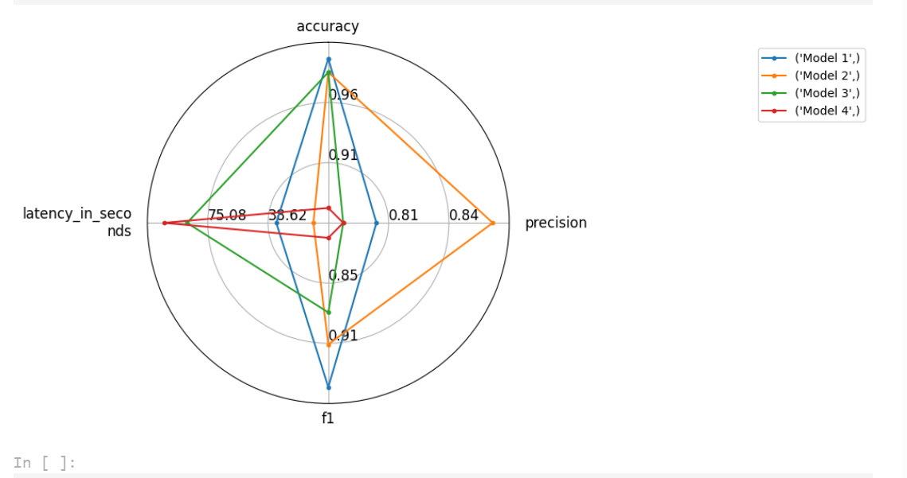

# 简介

- huggingface官方库，提供了大量的数据集、预训练模型等

# transformer及相关库

- transformer：核心库，模型加载，训练，流水线等

- tokenizer：分词器，数据预处理，文本到token序列的互相转换、分词等

- datasets：数据集库，数据集的加载处理等方法

- evaluate：评估，各种评估指标的计算函数

- PEFT：高效微调模型库，提供高效微调模型的方法，只需修改小参数

- Accelerate：分布式训练，提供分布式训练解决方案，包含大模型加载与推理解决方案

- Optimum：优化加速库，支持多种后端，例，Onnxruntime、OpenVino

- Gradio：可视化部署库，快速实现web交互的算法演示系统

# Pipeline

将模型加载、数据预处理、结果处理等过程串起来的流水线，使我们直接输入文本即可获取答案

```python
form transformers import pipeline

#简单案例
pipe=pipeline('text-classification')#未提供模型，下载一个默认模型

#指定任务类型，在指定模型，基于指定模型的pipe
pipe=pipeline('text-classification',
	model=''#模型路径hugface
)
pipe('XXX')

#先加载模型，在创建管道
from transformers import AutoModelForSequenceClassification, AutoTokenizer

tokenizer = AutoTokenizer.from_pretrained('BAAI/bge-reranker-v2-m3')#模型路径hugface
model = AutoModelForSequenceClassification.from_pretrained('BAAI/bge-reranker-v2-m3')

pipe=pipeline('text-',
	model=model,
	tokenizer=tokenizer,
	device='cuda',#指定GPU
)

```

# tokenizer

数据预处理步骤：：

1. 分词，利用分词器对文本数据进行分词 （字、字词）例：jieba

1. 构建词典：构建词典映射

1. 数据转换：将文本序列转为数字序列

1. 数据填充与截断，保证数据格式维度大小都一致

## **基本使用：**

```python

# 一键使用
sens = ["弱小的我也有大梦想",
        "有梦想谁都了不起",
        "追逐梦想的心，比梦想本身，更可贵"]
res = tokenizer(sens)
'''

{'input_ids': [
[101, 2483, 2207, 4638, 2769, 738, 3300, 1920, 3457, 2682, 102], 
[101, 3300, 3457, 2682, 6443, 6963, 749, 679, 6629, 102], 
[101, 6841, 6852, 3457, 2682, 4638, 2552, 8024, 3683, 3457, 2682, 3315, 6716, 8024, 3291, 1377, 6586, 102]
], 'token_type_ids': [[0, 0, 0, 0, 0, 0, 0, 0, 0, 0, 0], [0, 0, 0, 0, 0, 0, 0, 0, 0, 0], [0, 0, 0, 0, 0, 0, 0, 0, 0, 0, 0, 0, 0, 0, 0, 0, 0, 0]], 'attention_mask': [[1, 1, 1, 1, 1, 1, 1, 1, 1, 1, 1], [1, 1, 1, 1, 1, 1, 1, 1, 1, 1], [1, 1, 1, 1, 1, 1, 1, 1, 1, 1, 1, 1, 1, 1, 1, 1, 1, 1]]}

'''
```


```python
from transformers import AutoTokenizer

sen = "弱小的我也有大梦想!"

#1. 加载与保存

# 从HuggingFace加载，输入模型名称，即可加载对于的分词器
tokenizer = AutoTokenizer.from_pretrained("uer/roberta-base-finetuned-dianping-chinese")

# tokenizer 保存到本地
tokenizer.save_pretrained("./roberta_tokenizer")

# 从本地加载tokenizer
tokenizer = AutoTokenizer.from_pretrained("./roberta_tokenizer/")
```

```python
#2. 句子分词
tokens = tokenizer.tokenize(sen)

#查看该分词器的词典，为了更好的理解中文会在一些词上加特殊符号区分
tokenizer.vocab

#词典的大小
tokenizer.vocab_size

#3. 索引转换

# 将词序列转换为id序列
ids = tokenizer.convert_tokens_to_ids(tokens)
# 将id序列转换为token序列
tokens = tokenizer.convert_ids_to_tokens(ids)

# 将token序列转换为string
str_sen = tokenizer.convert_tokens_to_string(tokens)

# 将字符串转换为id序列，又称之为编码
ids = tokenizer.encode(sen, add_special_tokens=True)#add_special_tokens
添加开始cls和结束sep标志
# 将id序列转换为字符串，又称之为解码
str_sen = tokenizer.decode(ids, skip_special_tokens=False)#跳过开始cls和结束sep标志


#5 填充与截断
# 填充
ids = tokenizer.encode(sen, padding="max_length", max_length=15)

# 截断
ids = tokenizer.encode(sen, max_length=5, truncation=True)

inputs = tokenizer.encode_plus(sen, padding="max_length", max_length=15)
'''
{'input_ids': [101, 2483, 2207, 4638, 2769, 738, 3300, 1920, 3457, 2682, 106, 102, 0, 0, 0], 'token_type_ids': [0, 0, 0, 0, 0, 0, 0, 0, 0, 0, 0, 0, 0, 0, 0], 'attention_mask': [1, 1, 1, 1, 1, 1, 1, 1, 1, 1, 1, 1, 0, 0, 0]}
token_type_ids句子第几句
attention_mask，真实的，0为填充
'''
```

**Fast / Slow Tokenizer**

- Fast Tokenizer 基于rust实现，速度快，slow纯python

- 加载分词器默认Fast Tokenizer ，slow 添加use_fast=False参数

- Fast Tokenizer 添加  return_offsets_mapping=True

- 

```python

inputs = fast_tokenizer(sen, return_offsets_mapping=True)
inputs

{'input_ids': [101, 2483, 2207, 4638, 2769, 738, 3300, 1920, 10252, 8221, 106, 102], 'token_type_ids': [0, 0, 0, 0, 0, 0, 0, 0, 0, 0, 0, 0], 'attention_mask': [1, 1, 1, 1, 1, 1, 1, 1, 1, 1, 1, 1], 'offset_mapping': [(0, 0), (0, 1), (1, 2), (2, 3), (3, 4), (4, 5), (5, 6), (6, 7), (7, 12), (12, 15), (15, 16), (0, 0)]}


inputs.word_ids()
[None, 0, 1, 2, 3, 4, 5, 6, 7, 7, 8, None]
7，7 dreaming 拆分成两个词，词库里有dream和ing ,(6, 7), (7, 12)
#重点在命名体识别，QA
```

## **特殊Tokenizer的加载**

```python
from transformers import AutoTokenizer

#有些模型是自己写的分词器，必须加上此参数trust_remote_code=True
tokenizer = AutoTokenizer.from_pretrained("Skywork/Skywork-13B-base", trust_remote_code=True)

```


# model

## transform模型简介

http://t.csdnimg.cn/I7FlG

使用了**Self-Attention** 结构，相比 RNN 网络结构，其最大的优点是可以并行计算。

Transformer 的整体模型架构图：


- 原始的Transformer为编码器(Encoder)、解码器(Decoder)模型

- Encoder部分接收输入并构建其完整特征表示

- Decoder部分使用Encoder的编码结果以及其他的输入生成目标序列

- 无论是编码器还是解码器，均由多个TransformerBlock堆叠而成

- TransformerBlock由注意力机制(Attention)和FFN组成

- 注意力机制的使用是Transformer的一个核心特性，在计算当前词的特征表示时，可以通过注意力机制有选择性的告诉模型要使用哪些上下文

### 模型类型

- 编码器类型:自编码模型，使用encoder，双向的注意力机制，计算每个词的特征时都能看到完整的上下文，常用的预训练模型：Bert、ALBERT等Bert变体，适用于文本分类、命名实体识别、阅读理解

- 解码器类型：自回归模型，使用decoder，单向的注意力机制，计算每个词的特征时只能看到前文，常用预训练模型:GPT、GPT2、Bloom、LLaMA，适用于文本分类

- 编码器-解码器模型：序列到序列模型，使用encoder+decoder，encoder部分单向，decoder双向，常用预训练模型:BART, T5,Marian,mBART,GLM，适用于文本摘要、机器翻译


## Model Head（任务头4）

- 是连接在模型后的层，通常是1个或多个全连接层

- model head 将模型输出的编码结果进行映射，不同的处理以解决不同的任务

- 例如：Model(模型本身，只返回编码结果)、ForQuestionAnswering等

## Model的基本使用

```python
from transformers import AutoConfig, AutoModel, AutoTokenizer

#在线加载
model = AutoModel.from_pretrained("hfl/rbt3", force_download=True)

#离线加载，模型下载到本地
model = AutoModel.from_pretrained("./rbt3")

```

```python
#模型加载参数
model.config
config = AutoConfig.from_pretrained("./rbt3/")
#输出一样，但config.相对应的参数就能输出出来
BertConfig {
  "_name_or_path": "rbt3",
  "architectures": [
    "BertForMaskedLM"
  ],
  "attention_probs_dropout_prob": 0.1,
  "classifier_dropout": null,
  "directionality": "bidi",
  "hidden_act": "gelu",
  "hidden_dropout_prob": 0.1,
  "hidden_size": 768,
  "initializer_range": 0.02,
  "intermediate_size": 3072,
  "layer_norm_eps": 1e-12,
  "max_position_embeddings": 512,
  "model_type": "bert",
  "num_attention_heads": 12,
  "num_hidden_layers": 3,
  "output_past": true,
  "pad_token_id": 0,
  "pooler_fc_size": 768,
  "pooler_num_attention_heads": 12,
  "pooler_num_fc_layers": 3,
  "pooler_size_per_head": 128,
  "pooler_type": "first_token_transform",
  "position_embedding_type": "absolute",
  "transformers_version": "4.36.2",
  "type_vocab_size": 2,
  "use_cache": true,
  "vocab_size": 21128
}
config.output_attentions
False
```


## 模型调用

```python


sen = "弱小的我也有大梦想！"
tokenizer = AutoTokenizer.from_pretrained("rbt3")
inputs = tokenizer(sen, return_tensors="pt")#return_tensors
返回张量类型pytorch
inputs
'''
{'input_ids': tensor([[ 101, 2483, 2207, 4638, 2769,  738, 3300, 1920, 3457, 2682, 8013,  102]]), 'token_type_ids': tensor([[0, 0, 0, 0, 0, 0, 0, 0, 0, 0, 0, 0]]), 'attention_mask': tensor([[1, 1, 1, 1, 1, 1, 1, 1, 1, 1, 1, 1]])}
'''
```

```python
#不带Model Head的模型调用
model = AutoModel.from_pretrained("rbt3", output_attentions=True)
#可以在这里更改配置
output = model(**inputs)
output

output.last_hidden_state.size()#last_hidden_state模型编码后的结果
#torch.Size([1, 12, 768])#一条数据，token长度为12

len(inputs["input_ids"][0])#12
```

```python
#带Model Head的模型调用
from transformers import AutoModelForSequenceClassification, BertForSequenceClassification#分类模型

clz_model = AutoModelForSequenceClassification.from_pretrained("rbt3", num_labels=10)

clz_model(**inputs)
#带有loss

SequenceClassifierOutput(loss=None, logits=tensor([[-0.1485, -0.5152,  0.2111, -0.6348,  0.5859,  0.5790,  0.2845, -0.1190,
         -0.0265, -0.4940]], grad_fn=<AddmmBackward0>), hidden_states=None, attentions=None)


clz_model.config.num_labels
#10
```

## 文本分类实例


# datasets 

transformer加载 数据集的模块

```python
from datasets import *
```

```python
#加载在线数据集
datasets = load_dataset("madao33/new-title-chinese")

#查看数据集
datasets
datasets["train"][0]
datasets["train"][:2]
datasets["train"]["title"][:5]
datasets["train"].column_names
datasets["train"].features

#加载数据集合集中的某一项任务
boolq_dataset = load_dataset("super_glue", "boolq")

按照数据集划分进行加载
dataset = load_dataset("madao33/new-title-chinese", split="train")
dataset = load_dataset("madao33/new-title-chinese", split="train[10:100]")
dataset = load_dataset("madao33/new-title-chinese", split="train[:50%]")
dataset = load_dataset("madao33/new-title-chinese", split=["train[:50%]", "train[50%:]"])

#数据集划分
dataset = datasets["train"]
dataset.train_test_split(test_size=0.1)
dataset = boolq_dataset["train"]
dataset.train_test_split(test_size=0.1, stratify_by_column="label") 

#数据选取与过滤
# 选取
datasets["train"].select([0, 1])
# 过滤
filter_dataset = datasets["train"].filter(lambda example: "中国" in example["title"])
filter_dataset["title"][:5]
```

**数据映射**

```python
def add_prefix(example):
    example["title"] = 'Prefix: ' + example["title"]
    return example
prefix_dataset = datasets.map(add_prefix)
prefix_dataset["train"][:10]["title"]
```

```python
from transformers import AutoTokenizer

tokenizer = AutoTokenizer.from_pretrained("bert-base-chinese")

def preprocess_function(example, tokenizer=tokenizer):
    model_inputs = tokenizer(example["content"], max_length=512, truncation=True)
    labels = tokenizer(example["title"], max_length=32, truncation=True)
    # label就是title编码的结果
    model_inputs["labels"] = labels["input_ids"]
    return model_inputs

processed_datasets = datasets.map(preprocess_function)
processed_datasets = datasets.map(preprocess_function, num_proc=4)#多线程处理
processed_datasets = datasets.map(preprocess_function, batched=True)
processed_datasets = datasets.map(preprocess_function, batched=True, remove_columns=datasets["train"].column_names)

```

**保存与加载**

```python
processed_datasets.save_to_disk("./processed_data")
processed_datasets = load_from_disk("./processed_data")
```

**加载本地数据集**

```python
#直接加载文件作为数据集
dataset = load_dataset("csv", data_files="./ChnSentiCorp_htl_all.csv", split="train")
dataset = Dataset.from_csv("./ChnSentiCorp_htl_all.csv")

#加载文件夹内全部文件作为数据集
dataset = load_dataset("csv", data_files=["./all_data/ChnSentiCorp_htl_all.csv", "./all_data/ChnSentiCorp_htl_all copy.csv"], split='train')

#通过预先加载的其他格式转换加载数据集
import pandas as pd

data = pd.read_csv("./ChnSentiCorp_htl_all.csv")
dataset = Dataset.from_pandas(data)

# List格式的数据需要内嵌{}，明确数据字段
data = [{"text": "abc"}, {"text": "def"}]
# data = ["abc", "def"]
Dataset.from_list(data)

#通过自定义加载脚本加载数据集
load_dataset("json", data_files="./cmrc2018_trial.json", field="data")
dataset = load_dataset("./load_script.py", split="train")

```

## Dataset with DataCollator

```python
from transformers import  DataCollatorWithPadding

dataset = load_dataset("csv", data_files="./ChnSentiCorp_htl_all.csv", split='train')
dataset = dataset.filter(lambda x: x["review"] is not None)

def process_function(examples):
    tokenized_examples = tokenizer(examples["review"], max_length=128, truncation=True)
    tokenized_examples["labels"] = examples["label"]
    return tokenized_examples
tokenized_dataset = dataset.map(process_function, batched=True, remove_columns=dataset.column_names)
tokenized_dataset
print(tokenized_dataset[:3])
collator = DataCollatorWithPadding(tokenizer=tokenizer)
from torch.utils.data import DataLoader
dl = DataLoader(tokenized_dataset, batch_size=4, collate_fn=collator, shuffle=True)
num = 0
for batch in dl:
    print(batch["input_ids"].size())
    num += 1
    if num > 10:
        break

```

# Evaluate

```python
import evaluate
```

```python
# 在2024-01-11的测试中，list_evaluation_modules无法完全显示支持的评估函数，但不影响使用
# 完成的评估函数可以在 https://huggingface.co/evaluate-metric 中查看
evaluate.list_evaluation_modules()
```

```python
evaluate.list_evaluation_modules(
  module_type="comparison",
  include_community=False,
  with_details=True)
```

```python
#加载评估函数
accuracy = evaluate.load("accuracy")
#查看函数说明
print(accuracy.description)
print(accuracy.inputs_description)

```

```python
#评估指标计算——全局计算
accuracy = evaluate.load("accuracy")
results = accuracy.compute(references=[0, 1, 2, 0, 1, 2], predictions=[0, 1, 1, 2, 1, 0])
#{'accuracy': 0.5}

#评估指标计算——迭代计算

accuracy = evaluate.load("accuracy")
for ref, pred in zip([0,1,0,1], [1,0,0,1]):
    accuracy.add(references=ref, predictions=pred)
accuracy.compute()

accuracy = evaluate.load("accuracy")
for refs, preds in zip([[0,1],[0,1]], [[1,0],[0,1]]):
    accuracy.add_batch(references=refs, predictions=preds)
accuracy.compute()

#多个评估指标计算
clf_metrics = evaluate.combine(["accuracy", "f1", "recall", "precision"])
clf_metrics.compute(predictions=[0, 1, 0], references=[0, 1, 1])
'''
{'accuracy': 0.6666666666666666,
 'f1': 0.6666666666666666,
 'recall': 0.5,
 'precision': 1.0}
'''
```

```python
#评估结果对比可视化
from evaluate.visualization import radar_plot   # 目前只支持雷达图

data = [
   {"accuracy": 0.99, "precision": 0.8, "f1": 0.95, "latency_in_seconds": 33.6},
   {"accuracy": 0.98, "precision": 0.87, "f1": 0.91, "latency_in_seconds": 11.2},
   {"accuracy": 0.98, "precision": 0.78, "f1": 0.88, "latency_in_seconds": 87.6}, 
   {"accuracy": 0.88, "precision": 0.78, "f1": 0.81, "latency_in_seconds": 101.6}
   ]
model_names = ["Model 1", "Model 2", "Model 3", "Model 4"]
plot = radar_plot(data=data, model_names=model_names)
```




# trainer

## 文本分类实例

```python
#导入相关包
from transformers import AutoTokenizer, AutoModelForSequenceClassification, Trainer, TrainingArguments
from datasets import load_dataset
```

```python
#加载数据集
dataset = load_dataset("csv", data_files="./ChnSentiCorp_htl_all.csv", split="train")
dataset = dataset.filter(lambda x: x["review"] is not None)
```

```python
#划分数据集
datasets = dataset.train_test_split(test_size=0.1)
```

```python
#数据集预处理
import torch

tokenizer = AutoTokenizer.from_pretrained("hfl/rbt3")

def process_function(examples):
    tokenized_examples = tokenizer(examples["review"], max_length=128, truncation=True)
    tokenized_examples["labels"] = examples["label"]
    return tokenized_examples

tokenized_datasets = datasets.map(process_function, batched=True, remove_columns=datasets["train"].column_names)
tokenized_datasets#?
```

```python
#创建模型
model = AutoModelForSequenceClassification.from_pretrained("hfl/rbt3")
```

```python
#创建评估函数
import evaluate

acc_metric = evaluate.load("accuracy")
f1_metric = evaluate.load("f1")
```

```python
def eval_metric(eval_predict):
    predictions, labels = eval_predict
    predictions = predictions.argmax(axis=-1)
    acc = acc_metric.compute(predictions=predictions, references=labels)
    f1 = f1_metric.compute(predictions=predictions, references=labels)
    acc.update(f1)
    return acc
```

```python
#创建TrainingArguments
train_args = TrainingArguments(output_dir="./checkpoints",      # 输出文件夹
                               per_device_train_batch_size=64,  # 训练时的batch_size
                               per_device_eval_batch_size=128,  # 验证时的batch_size
                               logging_steps=10,                # log 打印的频率
                               evaluation_strategy="epoch",     # 评估策略
                               save_strategy="epoch",           # 保存策略
                               save_total_limit=3,              # 最大保存数
                               learning_rate=2e-5,              # 学习率
                               weight_decay=0.01,               # weight_decay
                               metric_for_best_model="f1",      # 设定评估指标
                               load_best_model_at_end=True)     # 训练完成后加载最优模型
```

```python
#创建Trainer
from transformers import DataCollatorWithPadding
trainer = Trainer(model=model, 
                  args=train_args, 
                  train_dataset=tokenized_datasets["train"], 
                  eval_dataset=tokenized_datasets["test"], 
                  data_collator=DataCollatorWithPadding(tokenizer=tokenizer),
                  compute_metrics=eval_metric)
```

```python
#模型训练
trainer.train()
```

```python
#模型评估
trainer.evaluate(tokenized_datasets["test"])
```

```python
trainer.predict(tokenized_datasets["test"])
```

```python
from transformers import pipeline

id2_label = id2_label = {0: "差评！", 1: "好评！"}
model.config.id2label = id2_label
pipe = pipeline("text-classification", model=model, tokenizer=tokenizer, device=0)
```

```python
sen = "我觉得不错！"
pipe(sen)
```


# NLP transformers项目实战

## 基于Transformers的命名实体识别

```python
#导入相关包
import evaluate
from datasets import load_dataset
from transformers import AutoTokenizer, AutoModelForTokenClassification, TrainingArguments, Trainer, DataCollatorForTokenClassification
```

```python
#加载数据集
# 如果可以联网，直接使用load_dataset进行加载
#ner_datasets = load_dataset("peoples_daily_ner", cache_dir="./data")
# 如果无法联网，则使用下面的方式加载数据集
from datasets import DatasetDict
ner_datasets = DatasetDict.load_from_disk("ner_data")
```

```python
ner_datasets["train"][0]
ner_datasets["train"].features
label_list = ner_datasets["train"].features["ner_tags"].feature.names
```

```python
#数据集预处理
tokenizer = AutoTokenizer.from_pretrained("hfl/chinese-macbert-base")
tokenizer(ner_datasets["train"][0]["tokens"], is_split_into_words=True)   # 对于已经做好tokenize的数据，要指定is_split_into_words参数为True
res = tokenizer("interesting word")
res
res.word_ids()
```

```python
# 借助word_ids 实现标签映射
def process_function(examples):
    tokenized_exmaples = tokenizer(examples["tokens"], max_length=128, truncation=True, is_split_into_words=True)
    labels = []
    for i, label in enumerate(examples["ner_tags"]):
        word_ids = tokenized_exmaples.word_ids(batch_index=i)
        label_ids = []
        for word_id in word_ids:
            if word_id is None:
                label_ids.append(-100)
            else:
                label_ids.append(label[word_id])
        labels.append(label_ids)
    tokenized_exmaples["labels"] = labels
    return tokenized_exmaples
```

```python
tokenized_datasets = ner_datasets.map(process_function, batched=True)
print(tokenized_datasets["train"][0])
```

```python
#创建模型
# 对于所有的非二分类任务，切记要指定num_labels，否则就会device错误
model = AutoModelForTokenClassification.from_pretrained("hfl/chinese-macbert-base", num_labels=len(label_list))
model.config.num_labels
```

```python
#创建评估函数
# 这里方便大家加载，替换成了本地的加载方式，无需额外下载
seqeval = evaluate.load("seqeval_metric.py")
seqeval
```

```python
import numpy as np

def eval_metric(pred):
    predictions, labels = pred
    predictions = np.argmax(predictions, axis=-1)

    # 将id转换为原始的字符串类型的标签
    true_predictions = [
        [label_list[p] for p, l in zip(prediction, label) if l != -100]
        for prediction, label in zip(predictions, labels) 
    ]

    true_labels = [
        [label_list[l] for p, l in zip(prediction, label) if l != -100]
        for prediction, label in zip(predictions, labels) 
    ]

    result = seqeval.compute(predictions=true_predictions, references=true_labels, mode="strict", scheme="IOB2")

    return {
        "f1": result["overall_f1"]
    }
```

```python
#配置训练参数
args = TrainingArguments(
    output_dir="models_for_ner",
    per_device_train_batch_size=64,
    per_device_eval_batch_size=128,
    eval_strategy="epoch",
    save_strategy="epoch",
    metric_for_best_model="f1",
    load_best_model_at_end=True,
    logging_steps=50,
    num_train_epochs=1
)
```

```python
#创建训练器
trainer = Trainer(
    model=model,
    args=args,
    tokenizer=tokenizer,
    train_dataset=tokenized_datasets["train"],
    eval_dataset=tokenized_datasets["validation"],
    compute_metrics=eval_metric,
    data_collator=DataCollatorForTokenClassification(tokenizer=tokenizer)
)
```

```python
#模型训练
trainer.train()
```

```python
trainer.evaluate(eval_dataset=tokenized_datasets["test"])
```

```python
#模型预测
from transformers import pipeline
```

```python
# 使用pipeline进行推理，要指定id2label
model.config.id2label = {idx: label for idx, label in enumerate(label_list)}
model.config
```

```python
# 如果模型是基于GPU训练的，那么推理时要指定device
# 对于NER任务，可以指定aggregation_strategy为simple，得到具体的实体的结果，而不是token的结果
ner_pipe = pipeline("token-classification", model=model, tokenizer=tokenizer, device=0, aggregation_strategy="simple")
```

```python
res = ner_pipe("小明在北京上班")
res


# 根据start和end取实际的结果
ner_result = {}
x = "小明在北京上班"
for r in res:
    if r["entity_group"] not in ner_result:
        ner_result[r["entity_group"]] = []
    ner_result[r["entity_group"]].append(x[r["start"]: r["end"]])

ner_result
```

# 基于截断策略的机器阅读理解任务实现

```python
#导入相关包
from datasets import load_dataset, DatasetDict
from transformers import AutoTokenizer, AutoModelForQuestionAnswering, TrainingArguments, Trainer, DefaultDataCollator
```

```python
#数据集加载
# 如果可以联网，直接使用load_dataset进行加载
#datasets = load_dataset("cmrc2018", cache_dir="data")
# 如果无法联网，则使用下面的方式加载数据集
datasets = DatasetDict.load_from_disk("mrc_data")
datasets
datasets["train"][0]
```

```python
#数据预处理
tokenizer = AutoTokenizer.from_pretrained("hfl/chinese-macbert-base")
```

```python
sample_dataset = datasets["train"].select(range(10))
```

```python
tokenized_examples = tokenizer(text=sample_dataset["question"],
                               text_pair=sample_dataset["context"],
                               return_offsets_mapping=True,
                               return_overflowing_tokens=True,
                               stride=128,
                               max_length=384, truncation="only_second", padding="max_length")
tokenized_examples.keys()
```

```python
tokenized_examples["overflow_to_sample_mapping"], len(tokenized_examples["overflow_to_sample_mapping"])
```

```python
for sen in tokenizer.batch_decode(tokenized_examples["input_ids"][:3]):
    print(sen)
```

```python
print(tokenized_examples["offset_mapping"][:3])
print(tokenized_examples["offset_mapping"][0], len(tokenized_examples["offset_mapping"][0]))
```

```python
sample_mapping = tokenized_examples.pop("overflow_to_sample_mapping")
```

```python
for idx, _ in enumerate(sample_mapping):
    answer = sample_dataset["answers"][sample_mapping[idx]]
    start_char = answer["answer_start"][0]
    end_char = start_char + len(answer["text"][0])
    # 定位答案在token中的起始位置和结束位置
    # 一种策略，我们要拿到context的起始和结束，然后从左右两侧向答案逼近

    context_start = tokenized_examples.sequence_ids(idx).index(1)
    context_end = tokenized_examples.sequence_ids(idx).index(None, context_start) - 1

    offset = tokenized_examples.get("offset_mapping")[idx]
    example_ids = []

    # 判断答案是否在context中
    if offset[context_end][1] < start_char or offset[context_start][0] > end_char:
        start_token_pos = 0
        end_token_pos = 0
    else:
        token_id = context_start
        while token_id <= context_end and offset[token_id][0] < start_char:
            token_id += 1
        start_token_pos = token_id
        token_id = context_end
        while token_id >= context_start and offset[token_id][1] > end_char:
            token_id -=1
        end_token_pos = token_id
        example_ids.append([sample_mapping[idx]])
        
    print(answer, start_char, end_char, context_start, context_end, start_token_pos, end_token_pos)
    print("token answer decode:", tokenizer.decode(tokenized_examples["input_ids"][idx][start_token_pos: end_token_pos + 1]))
```

```python
def process_func(examples):
    tokenized_examples = tokenizer(text=examples["question"],
                               text_pair=examples["context"],
                               return_offsets_mapping=True,
                               return_overflowing_tokens=True,
                               stride=128,
                               max_length=384, truncation="only_second", padding="max_length")
    sample_mapping = tokenized_examples.pop("overflow_to_sample_mapping")
    start_positions = []
    end_positions = []
    example_ids = []
    for idx, _ in enumerate(sample_mapping):
        answer = examples["answers"][sample_mapping[idx]]
        start_char = answer["answer_start"][0]
        end_char = start_char + len(answer["text"][0])
        # 定位答案在token中的起始位置和结束位置
        # 一种策略，我们要拿到context的起始和结束，然后从左右两侧向答案逼近
        context_start = tokenized_examples.sequence_ids(idx).index(1)
        context_end = tokenized_examples.sequence_ids(idx).index(None, context_start) - 1
        offset = tokenized_examples.get("offset_mapping")[idx]
        # 判断答案是否在context中
        if offset[context_end][1] < start_char or offset[context_start][0] > end_char:
            start_token_pos = 0
            end_token_pos = 0
        else:
            token_id = context_start
            while token_id <= context_end and offset[token_id][0] < start_char:
                token_id += 1
            start_token_pos = token_id
            token_id = context_end
            while token_id >= context_start and offset[token_id][1] > end_char:
                token_id -=1
            end_token_pos = token_id
        start_positions.append(start_token_pos)
        end_positions.append(end_token_pos)
        example_ids.append(examples["id"][sample_mapping[idx]])
        tokenized_examples["offset_mapping"][idx] = [
            (o if tokenized_examples.sequence_ids(idx)[k] == 1 else None)
            for k, o in enumerate(tokenized_examples["offset_mapping"][idx])
        ]

    
    tokenized_examples["example_ids"] = example_ids
    tokenized_examples["start_positions"] = start_positions
    tokenized_examples["end_positions"] = end_positions
    return tokenized_examples
```

```python
tokenied_datasets = datasets.map(process_func, batched=True, remove_columns=datasets["train"].column_names)
tokenied_datasets
```

```python
print(tokenied_datasets["train"]["offset_mapping"][1])
```

```python
tokenied_datasets["train"]["example_ids"][:10]
```


​              